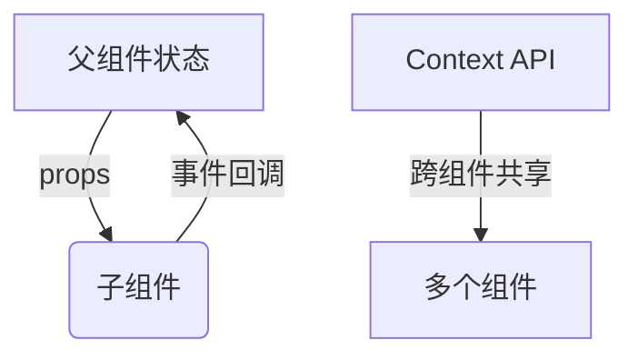
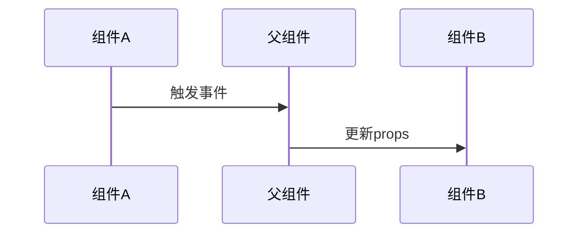
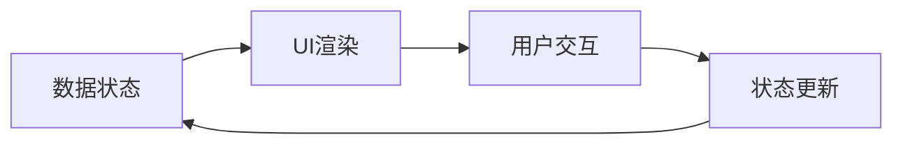

# React组件化开发实战：从"待办事项"看前端乐高搭建术

## 前言：当程序员开始写"待办事项"

每个程序员学习新框架时，都逃不过写一个"待办事项"(Todo List)应用的命运。这就像程序员的"Hello World"，只不过我们的"Hello"变成了"记得买牛奶"。

今天，我们就通过这个Todo List项目，来聊聊React组件化开发的那些事儿。放心，我不会像某些教程那样，一上来就给你讲16种生命周期方法——我们先从搭积木开始！

## 一、组件化：前端的乐高革命

### 1.1 从HTML标签到组件标签：构建思维的升级

还记得我们刚学前端时写的那些`<div>`、`<p>`标签吗？它们就像乐高积木里的基础颗粒。而React组件，则是把一堆基础颗粒预先组装好的"乐高套装"。

这种思维的转变带来了三大优势：

1. **功能封装**：每个组件都是独立的功能单元
```jsx
// Todoform.jsx - 专注输入处理
function Todoform({ onAdd }) {
  const [text, setText] = useState('')
  
  const handleSubmit = (e) => {
    e.preventDefault()
    if(text.trim()) onAdd(text)
    setText('')
  }

  return (
    <form onSubmit={handleSubmit}>
      <input 
        type="text"
        value={text}
        onChange={(e) => setText(e.target.value)}
        placeholder="输入新任务..."
      />
      <button type="submit">添加</button>
    </form>
  )
}
```

2. **样式隔离**：CSS-in-JS或scoped样式
```css
/* Todos.css - 组件级样式 */
.container {
  max-width: 600px;
  margin: 0 auto;
  padding: 20px;
  background: #f5f5f5;
  border-radius: 8px;
}

/* 不会影响其他组件的h1样式 */
.container h1 {
  color: #333;
  text-align: center;
}
```

3. **状态管理**：自包含的数据流


在我们的项目中：
- `<Todoform>` 是输入新任务的表单
- `<Todolist>` 是展示任务列表的区域
- `<Todos>` 则是把前两者组合起来的"超级套装"

```jsx
// Todos.jsx 中的组合艺术
return (
    <div className="container">
        <h1>{title}</h1>
        <Todoform onAdd={onAdd} />
        <Todolist list={list} />
    </div>
)
```

### 1.2 组件通信：构建组件社交网络

组件之间需要多种交流方式，就像社交网络中的不同关系：

1. **父子通信**：最直接的沟通渠道
```jsx
// 父组件传递数据和回调
<Todolist 
  items={todos} 
  onToggleComplete={toggleComplete}
  onDelete={deleteTodo}
/>

// 子组件接收和使用
function Todolist({ items, onToggleComplete, onDelete }) {
  return (
    <ul>
      {items.map(item => (
        <TodoItem 
          key={item.id}
          item={item}
          onToggle={onToggleComplete}
          onDelete={onDelete}
        />
      ))}
    </ul>
  )
}
```

2. **兄弟通信**：通过共同父组件


3. **跨层级通信**：使用Context API
```jsx
// 创建Context
const TodoContext = createContext()

// 提供数据
<TodoContext.Provider value={{ todos, dispatch }}>
  <Todos />
  <TodoStats />
</TodoContext.Provider>

// 消费数据
function TodoStats() {
  const { todos } = useContext(TodoContext)
  return <div>总任务数: {todos.length}</div>
}
```

4. **全局事件总线**：自定义事件系统
```jsx
// 创建事件发射器
const eventEmitter = new EventEmitter()

// 组件A订阅
useEffect(() => {
  eventEmitter.on('todoAdded', handleNewTodo)
  return () => eventEmitter.off('todoAdded', handleNewTodo)
}, [])

// 组件B发布
const addTodo = () => {
  eventEmitter.emit('todoAdded', newTodo)
}
```

1. **父传子**：`Todos`传给`Todolist`任务列表数据
```jsx
<Todolist list={list} />
```

2. **子传父**：`Todoform`把新任务文本传回给`Todos`
```jsx
// 父组件定义回调
const onAdd = (text) => {
    setList([...list, {id: list.length+1, text, completed: false}])
}

// 子组件调用
const subFrom = (e) => {
    e.preventDefault()
    onAdd(text) // 悄悄告诉爸爸：有新任务啦！
}
```

## 二、状态管理：React的记忆宫殿

### 2.1 useState深度解析：不只是简单的setter

`useState`看似简单，实则暗藏玄机：

1. **异步更新特性**：
```jsx
const [count, setCount] = useState(0)

// 错误示范
const handleClick = () => {
  setCount(count + 1)
  setCount(count + 1) // 不会累加，因为count值未变
}

// 正确做法：使用函数式更新
const handleClick = () => {
  setCount(prev => prev + 1)
  setCount(prev => prev + 1) // 会累加两次
}
```

2. **初始值懒加载**：
```jsx
// 避免在初始渲染时进行昂贵计算
const [data, setData] = useState(() => {
  const initialData = computeExpensiveValue()
  return initialData
})
```

3. **状态依赖问题**：
```jsx
useEffect(() => {
  const timer = setInterval(() => {
    console.log(count) // 闭包问题，总是打印初始值
  }, 1000)
  return () => clearInterval(timer)
}, []) // 缺少count依赖

// 解决方案：使用useRef或添加依赖
```

### 2.2 useReducer：更复杂的状态逻辑
```jsx
// 定义reducer
function todoReducer(state, action) {
  switch (action.type) {
    case 'ADD':
      return [...state, action.payload]
    case 'TOGGLE':
      return state.map(todo => 
        todo.id === action.id ? {...todo, completed: !todo.completed} : todo
      )
    case 'DELETE':
      return state.filter(todo => todo.id !== action.id)
    default:
      return state
  }
}

// 使用reducer
const [todos, dispatch] = useReducer(todoReducer, [])

// 派发action
dispatch({ type: 'ADD', payload: newTodo })
```

### 2.1 useState：组件的记忆芯片

还记得哆啦A梦的记忆面包吗？`useState`就是React组件的记忆装置。

在我们的`Todos`组件中：
```jsx
const [list, setList] = useState([
    {id: 1, text: '吃饭', completed: false}
])
```

这行代码相当于说："嘿React，帮我记住一个任务列表，默认有个'吃饭'的任务，别忘了给我修改它的方法！"

### 2.2 状态提升：把记忆面包放在合适的位置

初学者常犯的错误是把状态放在不合适的组件。在我们的项目中：
- 任务列表状态`list`放在`Todos`组件而非`Todolist`
- 因为`Todolist`只需要展示，而`Todos`需要管理添加逻辑

这就像把全家人的记忆面包放在客厅（父组件），而不是每个人的卧室（子组件）。

## 三、组件设计实战：从玩具到生产级应用

### 3.1 组件类型设计模式

1. **展示组件 vs 容器组件**
```jsx
// 展示组件 - 只关心UI
function TodoItem({ text, completed, onToggle }) {
  return (
    <li 
      style={{ textDecoration: completed ? 'line-through' : 'none' }}
      onClick={onToggle}
    >
      {text}
    </li>
  )
}

// 容器组件 - 处理业务逻辑
function TodoContainer() {
  const [todos, setTodos] = useState([])
  
  const handleAdd = text => {
    setTodos([...todos, { text, completed: false }])
  }

  return (
    <div>
      <Todoform onAdd={handleAdd} />
      <Todolist todos={todos} />
    </div>
  )
}
```

2. **高阶组件模式**
```jsx
function withLogger(WrappedComponent) {
  return function(props) {
    useEffect(() => {
      console.log('Component rendered:', WrappedComponent.name)
    }, [])
    return <WrappedComponent {...props} />
  }
}

const EnhancedTodoList = withLogger(Todolist)
```

3. **Render Props模式**
```jsx
function TodoProvider({ children }) {
  const [todos, setTodos] = useState([])
  
  const value = {
    todos,
    addTodo: text => setTodos([...todos, { text }])
  }

  return children(value)
}

// 使用
<TodoProvider>
  {({ todos, addTodo }) => (
    <>
      <Todoform onAdd={addTodo} />
      <Todolist todos={todos} />
    </>
  )}
</TodoProvider>
```

### 3.1 初版问题诊断

最初版本有个有趣的bug：
```jsx
// 错误示范
const onAdd = (list) => {  // 参数命名误导
    setList([
        ...list,
        {
            id: list.length + 1,
            list,  // 错误地把整个数组当成了text
            completed: false
        }
    ])
}
```

这导致添加新任务时，界面上会显示整个数组而不是任务文本——"记得买牛奶"变成了"[object Object]"！

### 3.2 修复方案

正确的做法应该是：
```jsx
const onAdd = (text) => {  // 明确参数是文本
    setList([
        ...list,
        {
            id: list.length + 1,
            text,  // 正确设置文本
            completed: false
        }
    ])
}
```

### 3.3 组件拆分艺术

好的组件划分就像好的厨具分类：
- `Todoform`：像炒锅，专门处理输入
- `Todolist`：像餐盘，专门展示内容
- `Todos`：像厨房，协调前后流程

## 四、高级技巧与性能优化

### 4.1 性能优化关键策略

1. **React.memo记忆组件**
```jsx
const Todolist = React.memo(function({ todos }) {
  return (
    <ul>
      {todos.map(todo => (
        <TodoItem key={todo.id} todo={todo} />
      ))}
    </ul>
  )
})
```

2. **useCallback缓存函数**
```jsx
const handleAdd = useCallback((text) => {
  setTodos(prev => [...prev, { text }])
}, []) // 空依赖表示函数不会重建
```

3. **useMemo缓存计算结果**
```jsx
const completedCount = useMemo(() => {
  return todos.filter(t => t.completed).length
}, [todos]) // 只有todos变化时才重新计算
```

4. **虚拟列表优化长列表**
```jsx
import { FixedSizeList as List } from 'react-window'

const Row = ({ index, style }) => (
  <div style={style}>
    {todos[index].text}
  </div>
)

<Todolist>
  <List
    height={400}
    itemCount={todos.length}
    itemSize={50}
  >
    {Row}
  </List>
</Todolist>
```

### 4.2 错误边界与调试技巧

1. **错误边界组件**
```jsx
class ErrorBoundary extends React.Component {
  state = { hasError: false }

  static getDerivedStateFromError() {
    return { hasError: true }
  }

  componentDidCatch(error, info) {
    logErrorToService(error, info)
  }

  render() {
    if (this.state.hasError) {
      return <h1>Something went wrong.</h1>
    }
    return this.props.children
  }
}

// 使用
<ErrorBoundary>
  <TodoApp />
</ErrorBoundary>
```

2. **React DevTools高级用法**
```jsx
// 在组件中添加调试信息
useDebugValue(todos.length > 0 ? `${todos.length} todos` : 'Empty')
```

### 4.1 数据驱动思维

现代React开发要记住：


不用再苦哈哈地操作DOM了，只要关心：
1. 数据是什么？（如`list`数组）
2. 数据怎么变？（如`setList`）
3. 数据用在哪？（如`{list.map(item => ...)}`）

### 4.2 组件设计原则

1. **单一职责**：每个组件只做一件事
2. **明确接口**：props就像组件说明书
3. **适度拆分**：不要过早优化，但也不要一个组件500行

## 五、Todo List的无限可能

我们的基础版还可以扩展：
1. 添加完成状态切换
2. 实现任务删除
3. 加入分类标签
4. 增加本地存储

```jsx
// 伪代码：未来可能的功能
const toggleComplete = (id) => {
    setList(list.map(item => 
        item.id === id ? {...item, completed: !item.completed} : item
    ))
}
```

## 结语：组件化思维改变前端开发

从jQuery的DOM操作，到React的组件化开发，前端工程师终于从"水泥匠"变成了"建筑师"。现在我们可以说：

"我不是在写代码，我是在用组件搭数字乐高！"

下次当你写`npx create-react-app`时，记得想想这个Todo List的故事。毕竟，每个复杂应用都是由简单组件组合而成的，就像乐高千年隼也是由一块块积木组成的。

现在，去给你的Todo List加个"记得写组件文档"的任务吧！（逃）
